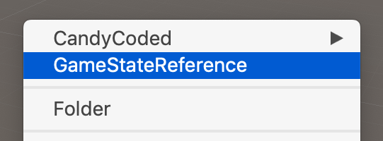

# Save & Load ScriptableObjects

This tutorial will walk you through creating persistent state across play sessions using a custom `ScriptableObject` and CandyCoded's `SaveManager` feature.

First, we will start by creating a `ScriptableObject` with the filename `GameStateReference`.

```csharp
using UnityEngine;

[CreateAssetMenu(fileName = "GameStateReference", menuName = "GameStateReference")]
public class GameStateReference : ScriptableObject
{

}
```

I've given the `ScriptableObject` a `CreateAssetMenu` name, so you can right-click within the asset panel and create a new instance for use with whatever name makes sense for your game.



Next, we will add state to the `GameStateReference`. I've opted to keep this example simple and store only a few properties related to the player and score. These can either be placed within the `GameStateReference` class or out of it depending on how you want to reference these objects.

```csharp
using System;

[Serializable]
public struct Player
{

    public string playerName;

    public float currentHealth;

}

[Serializable]
public struct Score
{

    public int currentScore;

    public int highScore;

}
```

> Note: Both of these structs must be `Serializable`, or the `SaveManager` won't be able to save data out or load data into them.

Next, we add properties with the newly created struct types to the `GameStateReference`.

```csharp
using UnityEngine;

[CreateAssetMenu(fileName = "GameStateReference", menuName = "GameStateReference")]
public class GameStateReference : ScriptableObject
{

    public Player player;

    public Score score;

}
```


Now, we add public methods for saving and loading data in and out of the `GameStateReference`.

```csharp
using System;
using UnityEngine;
using CandyCoded;

[CreateAssetMenu(fileName = "GameStateReference", menuName = "GameStateReference")]
public class GameStateReference : ScriptableObject
{

    public Player player;

    public Score score;

    public void SavePlayerData()
    {

        SaveManager.SaveData(player, "Player.dat");

    }

    public void SaveScoreData()
    {

        SaveManager.SaveData(score, "Score.dat");

    }

    public void Load()
    {

        try
        {

            player = SaveManager.LoadData<Player>("Player.dat");
            score = SaveManager.LoadData<Score>("Score.dat");

        }
        catch (Exception err)
        {

            Debug.LogWarning(err.Message);

        }

    }

}
```

The try/catch block around the `LoadData` method call is there because when you first run this, those files won't exist. `LoadData` bubbles up an exception to let you know this. In most cases, this won't be something you would need to act on, but the exception is there if you need it.

Let's add this to your game! I've made a simple script with the filename `GameManager` to store a reference to our `GameStateReference` and have it load on enable and save on disable. Create an empty game object, attach this script to it, and drag and drop your `GameStateReference` into the field in the inspector.


```csharp
using UnityEngine;

public class GameManager : MonoBehaviour
{

    [SerializeField]
    private GameStateReference _gameStateReference;

    private void OnEnable()
    {

        _gameStateReference.Load();

    }

    private void OnDisable()
    {

        _gameStateReference.SavePlayerData();
        _gameStateReference.SaveScoreData();

    }

}
```

When using this in your game, you would most likely want to call `SavePlayerData` or `SaveScoreData` when a significant change was made to those files to make sure the change is stored.

---

**Final files:**

- [GameManager.cs](Scripts/GameManager.cs)
- [GameStateReference.cs](Scripts/GameStateReference.cs)
